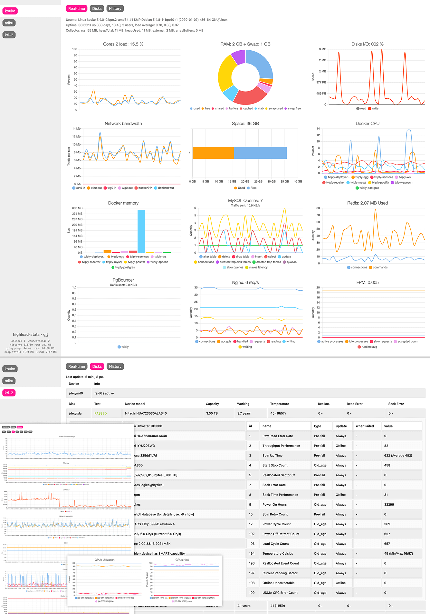

# highload-stats
HGLS Statistics – stats on servers in real-time graphs and history, easy and powerful.



## Install for Debian/Ubuntu/...
Execute in console
* Get code and install 
```bash
cd ~ && git clone https://github.com/oxmix/highload-stats.git && cd ./highload-stats/server && bash ./install.sh
```

## Settings autostart through systemd
* run in console # `sudo ./systemd.sh`
* then use `systemctl status hgls` or `journalctl -fu hgls`
* open in browser [`http://remote.host.io:8039`](http://remote.host.io:8039) or [`http://127.0.0.1:8039`](http://127.0.0.1:8039)

## Required
* Don't forget open firewall port 3939 for connection hgls-collectors
* Or settings proxy through nginx

## Install hgls-collector
* Install and run collector for each server [https://github.com/oxmix/hgls-collector](https://github.com/oxmix/hgls-collector)

### Run without systemd
* in console # `./index.js start` maybe also `stop|restart|debug`
* open in browser [`http://remote.host.io:8039`](http://remote.host.io:8039) or [`http://127.0.0.1:8039`](http://127.0.0.1:8039)
* also check logs maybe errors `tail -f ./hgls-error.log`

### If need get telemetry
* open in browser or curl `http://remote.host.io:8939/telemetry`

### Settings proxy
Example for proxy nginx >= 1.3.13
```nginx
server {
    listen 80;
    server_name remote.host.io;
    
    location / {
        proxy_pass http://127.0.0.1:8039;
        proxy_http_version 1.1;
        proxy_read_timeout 200s;
        proxy_set_header Upgrade $http_upgrade;
        proxy_set_header Connection "upgrade";
        proxy_set_header X-Real-IP $remote_addr;
        proxy_set_header X-Forwarded-For $proxy_add_x_forwarded_for;
    }

    location /collector {
        proxy_pass http://127.0.0.1:3939;
        proxy_http_version 1.1;
        proxy_read_timeout 200s;
        proxy_set_header Upgrade $http_upgrade;
        proxy_set_header Connection "upgrade";
        proxy_set_header X-Real-IP $remote_addr;
        proxy_set_header X-Forwarded-For $proxy_add_x_forwarded_for;
    }
}
```