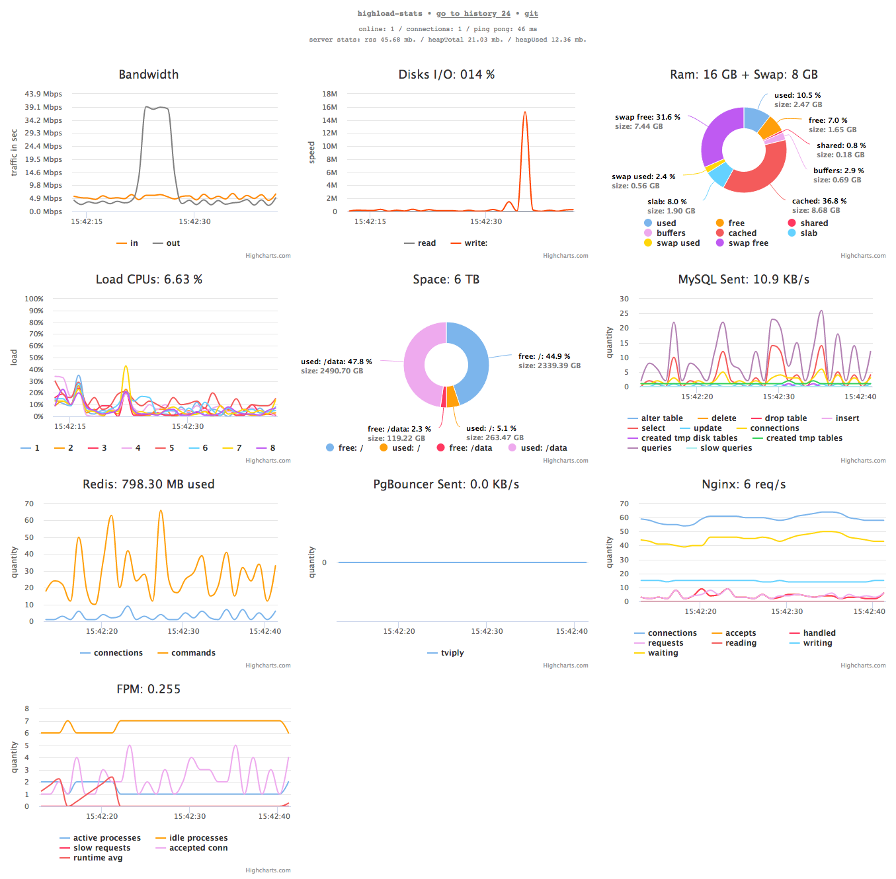

# highload-stats
HGLS Statistics server in real-time graphs.


## Install for Debian/Ubuntu/...
Execute in console
* Get code
```bash
cd ~ && git clone https://github.com/oxmix/highload-stats.git
```
* Install nodejs and sysutils
```bash
curl -sL https://deb.nodesource.com/setup_10.x | sudo -E bash - \
&& sudo apt-get update && sudo apt-get install nodejs ifstat iotop
```
* Install node depends
```bash
cd ~/highload-stats/server && chmod +x server.js && npm i
```
* If need postgres, redis, mysql
```bash
sudo apt-get install redis-tools postgresql-client mysql-client
```

* If need telemetry stats disks
```bash
sudo apt install smartmontools
```

## Run 
* in console # `sudo ./server/server.js start` maybe also `stop|restart`
* open in browser `http://remote.host.io:3939`

## If need only through access by key
* go to, console # `cd ~/highload-stats/server`
* create file .access-key in folder ./server, console # `</dev/urandom | fold -w 32 | head -n 1 | sha256sum | awk '{print $1}' > .access-key`
* now restart, console # `sudo ./server.js restart`
* open in browser `http://remote.host.io:3939/-access-key-`, your -access-key- in file .access_key

## Debug 
* back-end - run console `sudo ./server/server.js debug` or only `info|warn|error`
* frond-end - `./web/external/common.js` => `debug: true`
* also check logs maybe errors `tail -f ./server/hgls-error.log`

## Proxy 
Example for proxy nginx >= 1.3.13
```nginx
server {
    location /highload-stats/ {
        proxy_pass http://remote.host.io:3939;
        proxy_http_version 1.1;
        proxy_set_header Upgrade $http_upgrade;
        proxy_set_header Connection "upgrade";
    }
}
```

## Setting PgBouncer
```bash
echo '"pgbouncer" ""' >> /etc/pgbouncer/userlist.txt \
&& systemctl restart pgbouncer
```

## Enable stats for Nginx and FPM
* Nginx add server
```nginx
server {
    listen 80 default;
    listen [::]:80 ipv6only=on;
    server_name default;

    location / {
        return 444;
    }

    location /hgls-nginx {
        stub_status on;
        access_log off;
        allow 127.0.0.1;
        deny all;
    }

    location /hgls-fpm {
        access_log off;
        include /etc/nginx/fastcgi_params;
        fastcgi_pass unix:/run/phpX.X-fpm.sock;
        allow 127.0.0.1;
        deny all;
    }
}
```
* FPM
```bash
sed -i 's/;pm.status_path = \/status/pm.status_path = \/hgls-fpm/' /etc/php/X.X/fpm/pool.d/www.conf
```
* Then
```bash
nginx -s reload && systemctl restart phpX.X-fpm
```